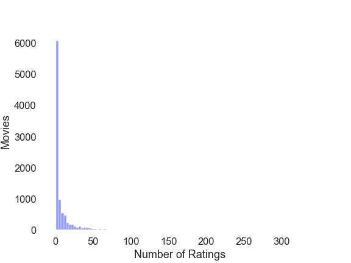

# Movie Recommendation System Using Machine Learning

**Authors:** Will Bennett, James Meredith
***


## Summary
Recommendation systems use machine learning to solve the long-tail problem with digital content. There is a lot of content out on the internet so it would take a person a long time to sort through it to find something they like. Recommendation systems help with that by suggesting content to people. [Netflix estimates](https://towardsdatascience.com/deep-dive-into-netflixs-recommender-system-341806ae3b48) it gets around 80% of total watch time thanks to its recommendation system.

We are using the famous [MovieLense dataset](https://grouplens.org/datasets/movielens/latest/) (small) consisting of 100,000 ratings and 3,600 tag applications applied to 9,000 movies by 600 users. The data is fairly clean so most of the preperation involved manipulating the datasets into formats that can be used by recommendation systems. Some recommendation systems use the format provided, but `ALS by hand` and `cosign similarity` required some modifications.

Our data has a long tail with many movies with <50 ratings.



Our modeling approach was:
- Start with a content-based system using cosign similarity, a commonly used distance measurement for recommendation systems
- Move to collaborative filtering using surprise, the popular library for implementing predictive recommendation systems
- Introduce ALS by hand to cement our understanding of the approach
- Implement ALS in Spark using pyspark separately, spark is commonly used to implement ALS at scale

We evaluated these models using RMSE as the measurement. Netflix's famous competition that offered $1M to a winner that could improve their content recommendation algorythm by 10% RMSE which was finally won by BellKor’s Pragmatic Chaos in 2009 with an RMSE of 0.8567. We decided that was our goal. All models were trained on train data, cross validated, and then evaluated on test data.

*Note: ratings were on a scale of 1-5 so a RMSE of 1 means the average prediction was off by a whole score*

Our best performing model was SVD optimized using gridsearch using surprise. Our recommendation however is to use ALS via spark to start however because of the efficiency of ALS and Spark in handling large datasets. 

## Business Problem
Our imaginary client, ACME corp. is launching ACME+, a digital asset hosting service focusing on movies. As part of their launch they want to start recommending movies to their users. Their R&D department is unfamiliar with recommendation systems so they've hired us to come up with some example recommendation systems and present to their engineering leads so they can focus their efforts.

## Data
We are using the famous [MovieLense dataset](https://grouplens.org/datasets/movielens/latest/) (small) consisting of 100,000 ratings and 3,600 tag applications applied to 9,000 movies by 600 users. The data is fairly clean so most of the preperation involved manipulating the datasets into formats that can be used by recommendation systems. Some recommendation systems use the format provided, but `ALS by hand` and `cosign similarity` required some modifications.

## Methods
Our modeling approach was:
- Start with a content-based system using cosign similarity, a commonly used distance measurement for recommendation systems
- Move to collaborative filtering using surprise, the popular library for implementing predictive recommendation systems
- Introduce ALS by hand to cement our understanding of the approach
- Implement ALS in Spark using pyspark separately, spark is commonly used to implement ALS at scale

*Note: Collaborative filtering and ALS have a problem with cold start, aka new movies that join the site that don't have any ratings yet.*

## Results
We evaluated these models using RMSE as the measurement. Netflix's famous competition that offered $1M to a winner that could improve their content recommendation algorythm by 10% RMSE which was finally won by BellKor’s Pragmatic Chaos in 2009 with an RMSE of 0.8567. We decided that was our goal. All models were trained on train data, cross validated, and then evaluated on test data.

*Note: ratings were on a scale of 1-4 so a RMSE of 1 means the average prediction was off by a whole score*

Model RMSE Results:
- Baseline ALS: 1.1
- Optimized ALS: 0.87
- KNNBasic: 0.947
- KNNWithMeans: 0.895
- KNNWithZScore: 0.895
- KNNBaseline: 0.874
- SVD: 0.875
- CoClustering: 0.941
- **SVD Optimized: 0.856** (winner)
  
## Conclusions
Business recommendations:
- ALS for efficiency and ease of implementation
- Hybrid approach to handle cold start
- Spark for scale (big data)

## Next steps
- Introduce Ensemble methods to further improve RMSE
- Adopt a hybrid approach (collaborative + content-based) to address cold start
- Dive deeper into spark, scale with large dataset

## For More Information

Please review the full analysis in [the Jupyter Notebook](./index.ipynb) or [the presentation](./presentation.pdf).

For any additional questions, please contact William Bennett at <jam637.jlm@gmail.com> James Meredith at <jam637.jlm@gmail.com>.

## Repository Structure

```
├── images
├── presentation.pdf
├── .gitignore
├── README.md
├── index.ipynb (main notebook)
└── spark.ipynb (spark implementation)
```
